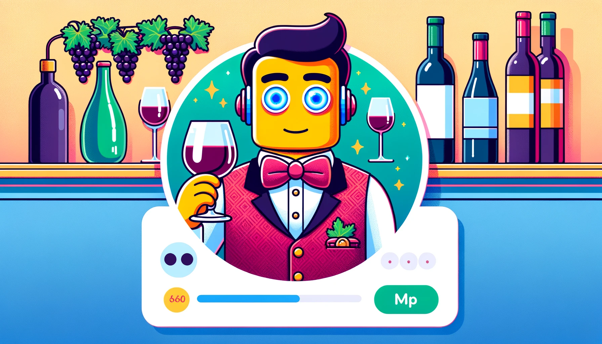
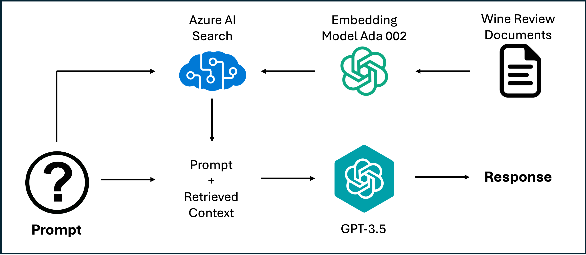

# LLMOps with Microsoft Azure - Sommellier Chatbot



## Introduction:
Developed a sommelier chatbot that helps you find the wine for your taste using Microsoft Azure, LangChain, and Retrieval-Agumented Generation (RAG). The app is powered by FastAPI and Streamlit. Special thanks to [Ivan Portilla](https://github.com/iportilla) for providing me access to Azure OpenAI and his excellent Applied Deep Learning course at the University of Colorado, Boulder.


> The chatbot can be accessed at https://barneyllm.azurewebsites.net/

## Main Technologies:
- ### Microsoft Azure & Azure OpenAI
    Azure services were used to host and manage the app's backend and data storage. OpenAI models - text-embedding-ada-002 and gpt-3.5-turbo - were used for embeddings and chat bot respectively.

- ### LangChain
    LangChain was employed to manage the interaction between the chatbot's language model and its backend logic, ensuring smooth communication and data retrieval processes that underpin the chatbot's conversational abilities.
- ### FastAPI
    FastAPI was used to build the backend of the application, providing robust API routes that handle requests efficiently and manage the interaction between the frontend, the AI models, and the database.
- ### Streamlit
    Streamlit was chosen to develop the user interface of the chatbot. It powers the frontend, presenting users with an interactive and user-friendly interface to input their wine preferences and receive recommendations.
- ### Docker
    Docker was used to containerize the entire application, ensuring that it runs consistently across different computing environments. The use of Docker also simplifies the deployment and scaling of the application.
- ### GitHub Actions
    GitHub Actions was implemented for continuous integration and continuous deployment (CI/CD) of the chatbot application. This setup automates tests and deployments, ensuring that updates to the codebase are smoothly integrated and deployed to production environments without disruption



## What is Retrieval-Augmented Generation (RAG)?
Retrieval-Augmented Generation (RAG) is a hybrid AI technique that combines the strengths of generative and retrieval-based models. It dynamically pulls relevant data from external sources to inform and refine the content generation process, producing outputs that are not only contextually accurate but also rich in detail.

### Wine Review Dataset
The [dataset](https://github.com/GregoryTomy/wine-llmops/blob/main/wine-ratings.csv) includes over 30,000 wine reviews, each detailed with attributes such as the name of the wine, grape type, region of origin, variety, rating, and descriptive notes. These notes are pivotal as they provide rich descriptions that capture the sensory experiences, aromas, and taste profiles of each wine. The dataset serves as the foundational knowledge base for the chatbot, enabling it to offer informed and personalized wine recommendations.

### Processing and Embedding Generation:
To effectively utilize this dataset within the RAG framework, the descriptive notes and other categorical data were processed to create embeddings. Embeddings are high-dimensional representations that encapsulate essential information from the texts in a form suitable for computational processing. The `Text Embeddings Ada 002` model from OpenAI was employed for this task, chosen for its ability to generate robust text representations. This model transforms the textual descriptions into vector embeddings that capture the key features of each wine review, preparing them for efficient retrieval.

### Uploading to Microsoft Azure AI Search:
After generating the embeddings, they were uploaded to Microsoft Azure AI Search, a cloud-based service adept at managing large data volumes and providing AI-enhanced indexing. This platform stores the embeddings and uses them to efficiently match user queries with relevant wine reviews. When users specify their taste preferences or inquire about particular types of wine, the chatbot leverages these embeddings to recommend the most suitable wines, fully utilizing the capabilities of RAG.

## Local Deployment Guide
This section will guide you through setting up the sommelier chatbot locally. Please ensure you have an Azure account and have set up an Azure AI search resource, as well as an Azure OpenAI or OpenAI API account to follow these steps.

### Project Structure
```bash
project-root/
│
├── wine-ratings.csv        # Dataset file containing the wine reviews
│
├── create_index.py         # Script to create the Azure AI search index
│
├── embeddings.py           # Script for generating embeddings using OpenAI's model
│
├── .env                    # Environment variables file
│
├── requirements.txt        # File listing all necessary Python packages
│
└── docker-compose.yml      # Docker configuration file for running the application
```
### Setup Instructions
1. Create a Python virtual environment and install required packages listed in `requirements.txt`.
2. Create a `.env` file to store environement variables needed for the application. Ensure that the file is loaded into your environment.
    ```
    # Azure Cognitive Services
    SEARCH_SERVICE_NAME=
    SEARCH_API_KEY=
    SEARCH_INDEX_NAME=

    # OpenAI
    OPENAI_API_KEY=


    # Azure Open AI
    AZURE_OPENAI_SERVICE=
    AZURE_OPENAI_ENDPOINT=
    AZURE_OPENAI_ADA_DEPLOYMENT=            # embeddding model name
    AZURE_OPENAI_CHAT_DEPLOYEMENT=          # chat model name
    AZURE_OPENAI_KEY=
    AZURE_OPENAI_API_VERSION=               # version for the embeddings model
    AZURE_OPENAI_API_VERSION_CHAT=          # version for the chat LLM used
    AZURE_OPENAI_EMBEDDING_DEPLOYMENT=
    AZURE_OPENAI_EMBEDDING_MODEL_NAME=

    # Streamlit App authenticator
    CREDENTIALS_USERNAME=
    CREDENTIALS_PASSWORD=
    CREDENTIALS_NAMES=
    COOKIE_NAME=
    COOKIE_KEY=
    COOKIE_EXPIRY_DAYS=5

    ```
3. Run `create_index.py` to set up an Azure AI search index. This index will store and retrieve the wine embeddings.
4. Run `embeddings.py` to generate text embeddings using the `text-embeddings-ada-002` model from OpenAI and to upload it to Azure AI search. Adjust the embedding function as necessary if using Azure OpenAI. Generating embeddings can be time-consuming; it took 84 minutes in this project.
5. Deploy the application using `docker-compose.yml`. Be sure to prove the `.env` file as an argument to configure the environment properly. 
6. Once Docker compose is complete, navigate to the provided Streamlit URL. Sign in using the username and password specified in the `.env` file.

You should now have a fully operational RAG-based LLM chatbot that recommends wines based on user preferences and queries.


## Next Update
- Include conversation history for back and forth conversation with Barney.